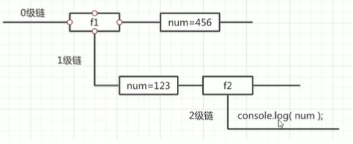
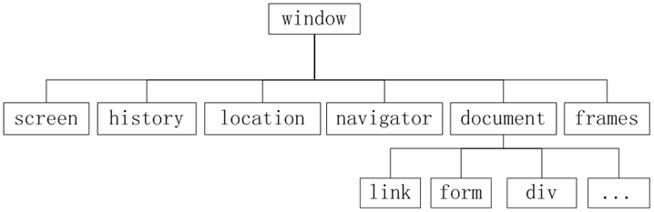
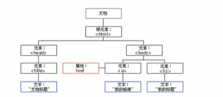
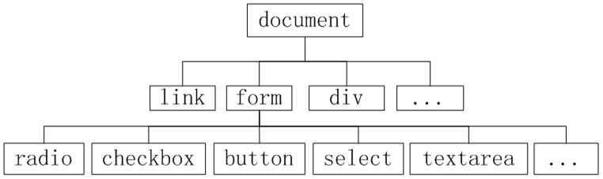

# javaScript

> 脚本语言：不需要编译，运行过程中js解释器（js引擎）逐行来进行解释并执行
>
> 解释性、嵌套在HTML中、弱数据类型、跨平台、基于对象、基于事件驱动、运行在客户端（可基于Node.js进行服务端编程）、动态语言
>
> 组成：ECMAScript、DOM、BOM

## 基础

### 样式

 内部

 ```html
 <script>
     alter("helloworld")
 </script>
 ```

外部引入

a.js

```javascript
alter("helloworld")
```

test.html

```html
<script src="a.js"></script>
```

行内

```html
<a href="javascript:alert('你好');"></a>
```

### 输入输出语句

- alert()：浏览器弹出警示框
- console.log()：浏览器控制台打印输出信息
- prompt()：浏览器弹出输入框，用户可以输入（返回值为字符串型）

### 变量

var
let
const

```javascript
var myName=prompt('请输入你的姓名：');
alert(myName);
```


###数据类型

> js的变量数据类型是只有在程序运行过程中，根据等号右边的值来确定的

#### 简单类型与复杂类型

简单类型又叫做基本数据类型或者==值类型==，复杂类型又叫做==引用类型==

- 值类型：在存储时变量中存储的是值本身 栈（string,number,boolean,undefined,null(返回是一个空的对象)）
- 引用类型：在存储时变量中存储的仅仅是地址（引用） 堆 (通过new关键字创建的对象，如Object、Array、Date等)

**tip**

js中没有堆栈的概念，此处帮助理解

传参问题

**number**
js不区分小数和整数

```javascript
123//整数
123.1//浮点数
1.123e3//科学计数法
-99//负数
NaN//not a number
Infinity//表示无限大
isNaN(n)//是数字返回false，不是返回true
```


**字符串string**
'abc',"abc","\n"

外双内单，外单内双

用 + 连接，字符串+其他类型为字符串类型


**布尔值boolean**

true,false

Boolean()

除0以外都为true

除' '之外的字符，都为true

null和undefined返回false


**null和undefined**

null表示空

undefined表示未定义

undefined==null返回true

#### 

**数组Array**

不需要类型相同,数组越界undefined

```javascript
var arr=[1,2,3,'hello']
```


**Function**


**对象Object**

数组中括号，对象大括号,属性逗号隔开

```javascript
var person={
  name:'xx',
  age:18
}
```


### 运算符


**逻辑运算符**

&&，||，！

==&&比||优先级高==

短路：

1. 逻辑与短路运算，若表达式1为真，则返回表达式2；若表达式1为假，则返回表达式1
2. 逻辑或短路运算，如果表达式1为真，则返回表达式1；如表达式1为假，则返回表达式2

```javascript
console.log(123&&456)//456
console.log(0&&456)//0
console.log(123||456)//123
console.log(0||456)//456
```


**算术运算符**

a++先取a的值，然后执行+1，先返回==原值==，再自加一

++a先执行+1,再取a的值，先自加一，再返回值

```html
<script>
    var a = 10;
    ++a;//++a=11  a=11
    var b = ++a + 2;//a = 12  ++a = 12;
    console.log(b);//14
    
    var c = 10;
    c++;//c++=11  c = 11
    var d = c++ + 2//c++ = 11  c = 12
    console.log(d);//13 
    
    var e = 10;
    var f = e++ + ++e;//1.e++ = 10  e =11 2. e = 12  ++e = 12
    consloe.log(f)//22(10+12)
</script>    
```


浮点数在算数运算中会出现问题

- document.write()向页面写入信息

  

**比较运算符**

```
=//赋值
==//等于（数值一样，类型可以不一样 返回true）支持自动转换
===//绝对等于（数值、类型都一样返回true）
```

须知：

- NaN与所有数值包括自己都不相等


> 严格模式“use strict”预防javascript随意性而产生的问题，script标签首行
>
> ==typeof 获取数据类型==


##流程控制

if判断

三目运算符 条件表达式? 表达式1:表达式2 ；真，返回表达式1；假，返回表达式2

**swicth语句**

**while循环**

执行思路：当条件表达式结果为true则执行循环体再执行计数器，否则退出循环

**do while循环**

```javascript
do{
    //循环体
}while(条件表达式)
```

先执行一次循环体，再判断条件

**for循环**

for循环的执行过程

```javascript
for(var i=1; i<=99; i++){
    console.log('Hello');
}
/*
先执行i=1(只执行一次)，
再执行i<=99，
接着执行console.log，
最后执行i++；
i=2，执行i<=99，再执行console，最后执行i++
...a
i=100，执行i<=99不满足跳出
*/
```

**双重for循环**

外层循环一次，里层循环全部

案例

```html
<script>
	var num = parseInt(prompt("班级总人数"));
	var score = 0;
	for (var i = 1; i <= num; i++) {
        score += parseFloat(prompt("第" + i + "学生的分数"));
	}
	alert("总成绩" + score);
	alert("平均成绩" + (score / num));gxing
    //打印星星（追加字符）
   var str = "";
			for (var i = 0; i < 5; i++) {
				for (var j = 0; j < 5; j++) {//打印倒三角将j<5改成j<5-i
					str += "⭐";
				}
				str += "\n";
			}
			console.log(str);
    //打印九九乘法表
    var str = "";
			for (var i = 1; i <= 9; i++) {
				for (var j = 1; j <= i; j++) {
					//str += "" + j + "×" + i + "=" + j * i + "\t";
					str += j + "×" + i + "=" + i * j + "\t";
				}
				str += "\n";
			}
			console.log(str);
</script>
```


**forEach循环**

````javascript
var age=[1,2,3,4,5];
age.forEach(function(value){
    console.log(value);
})
````

**for in循环**

```html
<script type="text/javascript">
	for(i in 'adasdasd'){
        console.log(i);
    }
    var x='sdsdsa';
    for(i in x){
        console.log(x.charAt(i));
    }
</script>
```

**for in**

遍历对象：for(var index in Object){}

```javascript
var obj = {
				name: "json",
				age: 12,
				sex: "男",
			};
			for (var k in obj) {
				console.log(k); //属性名
				console.log(obj[k]); //属性值
			}
```


continue 用于立即跳出被次循环，继续下一次循环（本次循环体中continue之后的代码就会少执行一次）

break 用户立即跳出整个循环（循环结束）

## 作用域

**JS作用域**

代码名字（变量）在某个范围的内起的作用和效果

目的是为了提高程序的可靠性并减少命名冲突

全局作用域：整个script标签

局部作用域：在函数内部

**全局变量和局部变量**

函数内部中没有声明的就赋值的也是全局变量

全局变量只有浏览器被关闭时才会被销毁，比较占内存

局部变量当程序完成时就会被销毁，在函数内部

块级作用域（ES6）{}

**作用域链**

根据内部函数可以范文外部函数变量的机制，用链式查找决定哪些数据能被内部函数访问，就称为作用域链



```javascript

var num=10;
function fn(){
    var num=20;
    function fun(){
        console.log(num);
    }
    fun();
}
fn();//20,若找不到再往上找一级
```

## 预解析

JavaScript代码是由浏览器中JavaScript解析器来执行的

JavaScript解析器在运行JavaScript代码的时候分为两步：==1.预解析和2.代码执行==

预解析js引擎会把js里面所有的声明变量（eg. var）和function提升到当前作用域的最前面

代码执行 按照代码的书写顺序从上往下执行

预解析分为 ==变量预解析==（变量提升）和==函数预解析==（函数提升）

- 变量提升 就是把所有变量声明提升到当前作用域的作用域最前面，不提升赋值操作
- 函数提升 就是把所有的函数声明提升到当前作用域的最前面，不调用函数

```javascript
var num = 10;
fn();
function fn(){
    console.log(num);
    var num = 20;
}
//上面代码相当于（预解析）
var num;
function fn(){
    var num;
    console.log(num);
    num = 20;
}
num = 10;
fn();
//控制台输出undefined
var a=b=c=9;//相当于 var a=9;b=9c=9;b,c为全局变量
```


## 函数

return后面的代码不会执行，函数没有return则返回undefined

不确定参数个数时，可以使用**arguments**来获取；JS中arguments实际上是一个当前函数的内置对象，arguments对象中存储了传递的所有实参

```javascript
(function () {
				function getMax() {
					let max = arguments[0];
					for (let i = 1; i < arguments.length; i++) {
						if (max < arguments[i]) {
							max = arguments[i];
						}
					}
					return max;
				}
				let re = getMax(5, 2, 99, 101, 67, 77);
				console.log(re);
			})();
```

==arguments==展示形式是一个**伪数组**

- 具有length属性
- 按索引方式储存数据
- 不具有数组的push、pop等方法

###预定义函数

javascript引擎中预先定义的

- parseInt()字符串转整型

- parseFloat()字符串转浮点型

  （还可以通过-、*、/将字符串转成数字型）

- isNaN() 

  是返回false，不是返回true

- isFinite() 是否无穷,是false，不是true

- escape()字符串转Unicode码

- unescape()解码

- 对话框alert()、prompt()、confirm()

### 自定义函数

使用函数时，先定义后调用

#### 命名函数

```html
<script type="text/javascript">
    function add(a,b){//add方法名
        a=a||0;//无数值就用0
        b=b||0;
        return a+b;
    }
    console.log(add());//打印到控制台，结果为0；若不赋值返回NaN
</script>
```

#### 匿名函数

网页前端设计者经常使用的一种函数形式，通过表达式形式来定义一个函数

- 匿名函数的定义格式与命名函数基本相同，只是不提供函数名称，且在函数结束位置以 ; 结束
- 由于没有函数名字，所以需要使用变量对匿名函数进行接收，方便后面函数体调用
- 需要调用

```html
<script type="text/javascript">
    var f=function(a,b){
        return a+b;
    }
    console.log(f);//打印函数内容
</script>
```

#### 对象函数

javascritpt还提供Function类，用于定义函数

Function是用来定义函数的关键字，首字母必须大写

```html
<script type="text/javascript">
    var f1=new Function('a','b','a+b');
    console.log(f1(2,3));//打印函数内容
</script>
```

#### 自调函数

函数本身不会自动执行，只有被调用时才会执行

自调函数，将函数的定义与调用一并实现

```html
<script type="text/javascript">
    (function(x1,x2){
        console.log(x1,x2);
    })(2,3);
</script>
```

```html
//点击box,输出box序号
<!DOCTYPE html>
<html>
	<head>
		<meta charset="utf-8" />
		<title></title>
		<style type="text/css">
			* {
				margin: 0;
				padding: 0;
			}
			
			.box {
				width: 100px;
				height: 100px;
				margin: 15px;
				background-color: red;
				cursor: pointer;
				float:left;
			}
		</style>
	</head>

	<body>
		<div class="box">0</div>
		<div class="box">1</div>
		<div class="box">2</div>
		<script type="text/javascript">
			var box=document.querySelectorAll(".box");
			console.log(box);
			for(var i=0;i<box.length;i++){
				(function(i){
					box[i].onclick=function(){
						console.log(box[i],i);
					}
				})(i);
			}//使用自调函数
			/*box.forEach(function(item,index){
				item.onclick=function(){
					console.log(item,index);
			});*///不使用自调
		</script>

	</body>

</html>
```


## 对象

> 对象是由属性和方法组成的
>
> JavaScript中的对象分为3种：自定义对象、内置对象、浏览器对象
>
> 内置对象就是指JS语言自带的一些对象，这些对象开发者使用，并提供一些常用或是最基本而必要的功能（属性和方法）

###1. Array数组对象

数组是一组数据的集合

**创建方式**

new Array();

new Array(size);

new Array(element0,element1...);

字面量 []

**属性**

constructor:获得具体对象类型

length

prototype：原型方法

**常用方法**

| 方法          | 描述                                                         |
| :------------ | :----------------------------------------------------------- |
| concat()      | 连接两个或多个数组                                           |
| join()        | 把数组中的所有元素放入一个字符串，并用指定的分隔符隔开，返回一个字符串 |
| push()        | 向数组末尾添加一个或多个元素，并返回新的长度                 |
| pop()         | 删除并返回数组的最后一元素                                   |
| shift()       | 删除并返回数组第一元素                                       |
| unshift()     | 在数组前面追加并返回数组长度                                 |
| reverse()     | 在原有数组的基础上，颠倒数组中的元素顺序，不会创建新的数组   |
| slice()       | 从已有数组中返回选定元素（包头不包尾，参数为负数从尾部开始）slice(start,[end]) |
| sort()        | 排序（不是按大小排序）                                       |
| splice()      | 向数组中添加或删除一个或多个元素，然后返回选定元素 splice(start,delnum,[item1,...]) |
| indexOf()     | 返回元素索引号（从前查找），不存在返回-1                     |
| lastIndexOf() | 返回元素索引号（从后查找）                                   |
| toString()    | 数组转字符串，返回字符串                                     |

[]:表示可不写

````html
/*排序*/
<script>
	var x=[1,28,34,5,7];
	x.sort(function(a,b){
    	return a-b;//从小到大排序
	});
    /*lambda表达式*/
    x.sort((x1,x2)=>x1-x2);
    //冒泡排序
    var arr = [5, 3, 4, 2, 1];
			for (var i = 0; i < arr.length; i++) {
				for (var j = 0; j < arr.length - i; j++) {
					if (arr[j] > arr[j + 1]) {
						let temp = arr[j];
						arr[j] = arr[j + 1];
						arr[j + 1] = temp;
					}
				}
			}
			console.log(arr);
    /*筛选数组*/
    var arr = [1500, 1200, 2000, 2100, 1800];
		var newArr = [];
		for (var i = 0; i < arr.length; i++) {
			if (arr[i] < 2000) {
				newArr.push(arr[i]);
			}
		}
		console.log(newArr);
</script>
````

````html
/*在prototype添加sum（）*/
<script>
    var a=[1,2,3,4,5];
    Array.prototype.sum=function(){
        var sum=0;
        let o=this;//this就是数组a
        for(var i=0;i<o.length;i++){
            sum+=o[i];
        }
    }
</script>
````

```javascript
//数组去重
/*
遍历旧数组，用旧数组元素去查询新数组元素，
如果元素未在新数组中出现则添加，否则不添加
通过indexOf()检验元素是否存在，不存在返回-1
*/
var arr = ["c", "a", "z", "a", "x", "a", "x", "c", "b"];
var newArr = [];
for (var i = 0; i < arr.length; i++) {
	if (newArr.indexOf(arr[i]) === -1) {
		newArr.push(arr[i]);
			}
}
console.log(newArr);
```


检测数组

- instanceof
- Array.isArray()(优先于instanceof、H5、ie9+)

**二维数组**

### 2. String 字符串对象

> 基本包装类型：把简单数据类型包装成复杂数据类型，这样基本数据类型就有了属性和方法
>
> js还提供了3种特殊的引用类型：String、Number和Boolean

**字面量方式**

```javascript
var a="13"//typeof 是string
```

**new方式**

```javascript
var a=new String("13")//typeof 是一个对象
var a1=String('13')//typeof 是string
```

**tips:**

==string与String的区别==

- String是string的包装类
- string是一种数据类型；String是构造函数用于创建字符串对象，使用new方法创建对象具有substring()方法
- 
- 使用==时，string只比较值，String还需比较是否为同一对象引用
- 生命周期不同，new创建的对象一直存在,string类型自动生成会在代码执行后立即摧毁

通过constructor获得具体对象类型

```javascript
var b=new String('1')
b.constructor==Stirng//返回true
```

**常用方法**

| 方法                                 | 描述                                                         |
| ------------------------------------ | ------------------------------------------------------------ |
| indexOf(searchValue,[fromIndex])     | 返回searchValue在字符串中首次出现的位置的位置                |
| lastIndexOf(searchValue,[fromIndex]) | 从后向前检索，返回searchValue在字符中首次出现的位置          |
| concat(str1,str2……)                  | 连接字符                                                     |
| slice(start,[end])                   | 抽取从start（包括）开始到end（不包括）位为止的所有字符，可取负数 |
| substring(start,[stop])              | 抽取start到stop-1的所有字符                                  |
| substr(start,length)                 | 从start开始（索引号）,length去的个数                         |
| charAt(index)                        | 获取指定位置的字符                                           |
| charCodeAt(index)                    | 获取指定位置字符的ASCIII码                                   |
| str[index]                           | 获取指定位置的字符（H5、ie8+等）                             |
| split(分隔符)                        | 把一个字符串分割成字符数组                                   |
| replace(被替换，替换)                | 替换字符，只替换第一个                                       |

[]:表示可不写,str除外

toUpperCase()、toLowerCase()转换大小写

```javascript
		//查找字符串'abcoefoxyozzopp'种所有o出现的位置以及次数
		/*
		核心算法：
		先找出第一个o出现的位置
		只要indexOf不为-1就继续往后查找
		*/
		var str = "abcoefoxyozzopp";
		var index = str.indexOf("o"); //第一个o出现的位置
		var num = 0;
		while (index !== -1) {
			console.log(index);
			num++;
			index = str.indexOf("o", index + 1); //索引+1的位置向后查找
		}
		console.log("o出现的次数：" + num);

//统计出现次数最多的字符
		/*
		核心算法：
		利用 charAt() 遍历字符串
		把每个字符都存储给对象，如果对象没有该属性，就为1，如果存在+1
		遍历对象，得到最大值和字符
		*/
		var str = "abcoefoxyozzopp";
		var o = {};
		for (var i = 0; i < str.length; i++) {
			var chars = str.charAt(i);
			if (o[chars]) {
				o[chars]++;
			} else {
				o[chars] = 1;
			}
		}
		var count = 0;
		var ch = "";
		for (var k in o) {
			if (o[k] > count) {
				count = o[k];
				ch = k;
			}
		}
		console.log("出现次数最多的字符是：" + ch, ",次数为：" + count);

```


**转义字符**

| 转义字符 | 实现方式 | 转义字符 | 实现方式 |
| -------- | -------- | -------- | -------- |
| 双引号   | \双引号  | 换行     | \n       |
| 单引号   | \单引号  | 回车     | \r       |
| Tab      | \t       | 反斜杠   | 双斜杠   |
| 退格     | \b       | 换页符   | \f       |

###3. Date日期对象

Date对象基于1970年1月1日起的毫秒数

**常用方法**

| 方法          |                             描述                             |
| ------------- | :----------------------------------------------------------: |
| getDate()     |                 返回一个月中的某一天（1~31）                 |
| getDay()      |                      返回一周中的某一天                      |
| getMouth()    |                       返回月份（0~11）                       |
| getFullYear() |                        返回4位数年份                         |
| getHours()    |                  返回Date对象的小时（0~23）                  |
| getMinutes()  |                  返回Date对象的分钟（0~59）                  |
| getSeconds()  |                  返回Date对象的秒数（0~59）                  |
| getTime()     | 返回1970年1月1日至今的毫秒数(valueOf()和 +new Date()也可以、Date.now()(H5)) |
| setXxx()      |                  设置日期对象的年月日等信息                  |

````html
<html>
	<head>
		<meta charset="utf-8" />
		<title></title>
	</head>
	<body>
		<div class="timer"></div>
		<script type="text/javascript">
			//获取timer的DOM对象
			var timer = document.querySelector(".timer");
			//创建当前日期对象
			function times() {
				var d = new Date();
				var y = d.getFullYear();
				var m = d.getMonth() + 1;
				var dd = d.getDate();
				var hh = d.getHours();
				var min = d.getMinutes();
				var ss = d.getSeconds();
				var s = y + "年" + m + "月" + dd + "日" + hh + "时" + min + "分" + ss + "秒";
				timer.innerHTML	=s;
			}
			times();
			//定时器
			setInterval(times,1000);
            
		</script>
	</body>
</html>
<!--
倒计时 采用时间戳
转换公式
d = parseInt(总秒数/60/60/24);
h = parseInt(总秒数/60/60%24);
m = parseInt(总秒数/60%60);
s = parseInt(总秒数%60);
-->
<!DOCTYPE html>
    <html>
        <head>
            <meta charset='utf-8'/>
            <title>倒计时</title>
        </head>
        <body>
            <div class='timer'>
                
            </div>
        </body>
        <script>
            var colck = document.querySelector(".timer");
			//倒计时 采用时间戳
			//转换公式
			//d = parseInt(总秒数/60/60/24);
			//h = parseInt(总秒数/60/60%24);
			//m = parseInt(总秒数/60%60);
			//s = parseInt(总秒数%60);
			function countDown() {
				var nowTime = +new Date(); //当前时间毫秒数
				var targetTime = +new Date("2021-2-16 02:00:00"); //目标时间毫秒数
				var times = (targetTime - nowTime) / 1000; //剩余时间秒数
				var d = parseInt(times / 60 / 60 / 24);
				d = d > 10 ? d : "0" + d;
				var h = parseInt((times / 60 / 60) % 24);
				h = h > 10 ? h : "0" + h;
				var m = parseInt((times / 60) % 60);
				m = m > 10 ? m : "0" + m;
				var s = parseInt(times % 60);
				s = s > 10 ? s : "0" + s;
				var contain = d + "天" + h + "时" + m + "分" + s + "秒";
				colck.innerHTML = contain;
			}

            countDown();
            setInterval(countDown,1000);
        </script>
</html>
````

```javascript
//时间补零
var addZone = function (x) {
	return x < 10 ? "0" + x : x;
};

    
```


### 4. Math数学对象

**方法**

| 方法       | 描述                         | 方法              | 描述                        |
| ---------- | ---------------------------- | ----------------- | --------------------------- |
| abs(x)     | 返回数字绝对值               | min(x,..)         | 求最小值                    |
| ceil(x)    | 对数字进行向上取整           | pow(x,y)          | 返回x的y次幂                |
| floor(x)   | 对数字进行向下取整           | sqrt(x)           | 返回数字平方根              |
| round(x)   | 对数字进行四舍五入           | random()          | 返回0~1之间的随机数([0,1))  |
| exp(x)     | 返回e的指数                  | sin/cos/tan(x)    | 计算x的正弦、余弦和正切值   |
| log(x)     | 返回数字的自然对数（底数为e) | asin/acos/atan(x) | 计算x的反正弦、余弦和正切值 |
| max(x,...) | 求最大值(无参返回-Infinity)  |                   |                             |

```javascript
//封装自己的数学对象
var myMath = {
	PI: 3.141592653,
	max: function () {
		var max = arguments[0];
		for (var i = 1; i < arguments.length; i++) {
			if (max < arguments[i]) {
				max = arguments[i];
			}
		}
		return max;
	},
	min: function () {
		var min = arguments[0];
		for (var i = 1; i < arguments.length; i++) {
			if (min > arguments[i]) {
				min = arguments[i];
			}
        }
		return min;
	},
};
console.log(Math.abs('-1'));//隐式转换 将字符串转换成数字

//等到两个数的随机整数 并包含这两个数
function getRandom(min, max) {
	return Math.floor(Math.readom()*(max-min+1))+min;
}

//1~50猜数字 10次机会
			var getRandom = function (min, max) {
				return Math.floor(Math.random() * (max - min + 1) + min);
			};
			var numGame = function () {
				var flag = getRandom(1, 50);
				console.log(flag);
				for (var i = 9; i >= 0; i--) {
					var num = prompt("请输入1-50之间的一个数字:");
					if (num > flag) {
						if (i != 0) alert("大了！你还有" + i + "次机会");
						else alert("机会已经用完！");
					} else if (num < flag) {
						if (i != 0) alert("小了！你还有" + i + "次机会");
						else alert("机会已经用完！");
					} else {
						alert("Bingo!");
						break;
					}
				}
			};
			numGame();
```


### 5. RegExp对象(？)

**创建**

1.直接量方式

​	var reg=/pattern/attribute;

2.构造函数方式

​	var regExp=new RegExp(pattern,attribute);

- pattern是一个字符串或表达式，表示正则表达式的模式
- attribute是一个可选字符串（取值包括“i”，“m”，“g”;分别用于指定全局变量、区分大小写匹配和多行匹配）

元字符

| 元字符 | 描述                                          |
| :----: | --------------------------------------------- |
|   ·    | 查找单个字符，除了换行和行结束符              |
|   \w   | 匹配包括下划线的任何单词字符等价于[A-Za-z0-9] |
|   \W   | 匹配任何非单词符，等价于[ ^A-Za-z0-9]         |
|        |                                               |
|        |                                               |
|        |                                               |
|        |                                               |
|        |                                               |
|        |                                               |

### 6. 自定义对象

**字面量 JSON**

```javascript
 var good={
        price:10.1,
        sale:!0,//true
        showInfo:function(){
            console.log('price=',this.price,'sale=',this.sale);
        },
        stop:!1//结束结尾不用,
    }
    good.showInfo();
```

**new(原始方法)**

```javascript
var o = new Object();
o.name = 'json';
o.age = 12;
o.showInfo = function(){
    console.log('name=',this.name,'age=',this.age);
}
console.log(o.name);//获取属性 console.log(o['age'])
o.showInfo();
```

**构造函数**

```javascript
function Person(name, age){
    this.name = name;
    this.age = age;
    this.getName = function(){
        console.log('name=',this.name);
    }
    this.getAge = function(){
        console.log('age=',this.age);
    }
}
var json=new Person('json',12);
json.getName();
json.getAge();
```

**原型方法**

```javascript
function Person(){}
Person.prototype.name='json';
Person.prototype.age=12;
Person.prototype.getName=function(){
    return this.name;
}
Person.prototye.getAge=function(){
    return this.age;
}
var json=new Person();
console.log('name=',json.getName())
```

> new 关键字的执行过程
>
> 1. new 构造函数可以在内存中创建一个空的对象
> 2. this 就会指向刚创建的空对象
> 3. 执行构造函数里面的代码，给这个空对象添加属性和方法
> 4. 返回这个对象（因此不需要return）

**混合方法（构造函数+原型）**

## BOM与DOM（Web APIs）

### BOM模型

定义了JavaScript操作的接口,提供了与浏览器窗口交互的功能，例如获取浏览器大小、版本信息、浏览历史记录等

用于描述浏览器中对象与对象之间层次关系的模型，提供了独立于页面内容、并能够与浏览器窗口进行交互的对象结构



浏览器会为每一页自动创建window、document、location、nacigator、history对象

- window对象是BOM模型中的最高一层，通过window对象的属性和方法来实现对浏览器窗口的操作
- document是BOM的核心对象，提供访问HTML文档对象的属性、方法以及事件处理
- location对象包含当前页面的URL地址，如协议名、主机名、端口号和路径等信息
- navigator对象包含与浏览器相关的信息，如浏览器类型、版本等
- history对象包含浏览器的历史访问记录,如访问过的URL、浏览数量等信息

### DOM

DOM（文档**对象**模型）是属于BOM的一部分，用于对BOM中的核心对象document进行操作，是W3C组织推荐的处理可拓展标记语言（HTML or XML）的标准编程接口

DOM是一种与平台、语言无关的接口，允许程序和脚本动态的访问和更新HTML或XML文档的内容、结构和样式，且提供一系列的函数和对象来实现访问、添加、修改及删除操作

#### DOM树



- 文档：一个页面就是一个文档，DOM中使用document表示
- 元素：页面中的所有标签都是元素，DOM中使用element表示
- 节点：页面中的所有内容都是节点（标签、属性、文本、注释等），DOM中是由node表示



#### 获取元素

> 文档页面是从上到下加载的，要先有标签，所以<script>写在下面

- 根据ID获取：getElementById() 返回的是一个元素对象
- 根据标签名获取：getElementByTagName() 返回的元素对象的集合，以伪数组形式呈现
- 通过HTML5新增方法获取(ie9+)：getElementsByClassName() 返回元素对象集合、querySelector('选择器') 返回第一个元素对象、querySelectorAll() 返回对象集合
- 特殊元素获取 （body&html）document.body 返回元素对象、document.documentElement

```html
<html>
<body>
    <div id='timer'>
        2021-02-19
    </div>
    <ul>
       	<li>1</li> 
		<li>2</li>
		<li>3</li>  
    </ul> 
    <div class="header">header</div>
    <div class="box">box1</div>
	<div class="box">box2</div>
    <script>
        //通过id
    	var timer = document.getElementById('timer');
       
        //通过标签名
        var lis = document.getElementByTagName('li');
        // 通过遍历依次打印
        for(var i = 0;i<lis.length;i++){
            console.log(lis[i]);
        }
        //通过父元素获取标签名 element.getElementByTagName(),使用时要指明是哪一个元素对象并且不包括父元素本省（可使用id简化）
        var u = document.getElementByTagName('ul');
        console.log(u[0].getElementByTagName('li'));
        
        //通过类名
        var box = document.getElementsByClassName("header");
        
        //通过选择器
        var firstBox = document.querySelector(".box");
        var timer2 = document.querySelector("#timer");
		var firstLi = document.querySelector("li");
        var allBox = document.querySelectorAll(".box");//返回对象集合
        
        //获取body和html
        var bodyEle = document.body;
		var htmlEle = document.documentElement;
        
        //console.dir() 打印返回的元素对象 方便查看属性和方法
    </script>
</body>      
</html>
```

#### 事件

**操作事件**：用户在浏览器中操作所产生的事件（鼠标事件、键盘事件、表单事件）

**文档事件**：文档本身所产生的事件，如文件加载完毕，卸载文档和窗口改变等事件

事件三要素（部分）：事件源、事件类型、事件处理程序

```html
<body>
    <button id='btn'>button</button>
    <script>
        //事件源 事件被触发的对象
        var btn = document.getElementById('btn');
        //事件类型 如何触发、事件处理程序 用函数完成
        btn.onclick = function () {
			alert("hello!");
		};
    </script>
</body>
```

**执行事件的步骤**

1. 获取事件源
2. 注册事件（绑定事件）
3. 添加事件处理程序（采取函数赋值形式）

```html
<!--HTML元素的属性绑定-->
<input type='button' onclick='doSomething()' id='muButton'/>
<script type='text/javascript'>
	function doSomething(){
        alert("Hello")
    }
</script>
<script type='text/javascript'>
	//javasript脚本动态绑定
    var myButton=document.getElementById('muButton');
    myButton.onmouseover=function(){
        alert('')
    }
</script>
```

#### 操作元素

##### 改变元素内容

element.innerText：从起始位置到终止位置的内容，但取出html标签，同时空格和换行也会去掉

element.innerHTML：起始位置到终止位置的全部内容，包括html标签，同时保留空格和换行

**innnerText和innerHTML的区别**

1. innerText不识别<...>标签(html标签)，innerHTML识别
2. innerText非标准，innerHTML W3C标准
3. 读取时，innerText不读标签并且去除空格和换行

```html
<body>
	<button>显示当前系统时间</button>
	<div>某个时间</div>
	
	<script>
        //点击按钮显示时间
		var btn = document.querySelector("button");
		var box = document.querySelector("div");
		function getDate() {
			var now = new Date();
			var year = now.getFullYear();
			var month = now.getMonth() + 1;
			var day = now.getDate();
			var hour = now.getHours();
			var minute = now.getMinutes();
			var time = year + "年" + month + "月" + day + "日" + hour + "时" + minute + "分";
			return time;
		}
		btn.onclick = function () {
			box.innerHTML = getDate();
		};
		
	</script>
</body>
```

##### 常用元素的属性操作

- innerText和ininerHTML修改元素内容
- src、href
- id、alt、title

```html
//修改元素属性
<body>
		<button id="pic1">pic1</button>
		<button id="pic2">pic2</button>
		
        <script>
			var btn1=document.getElementById('pic1');
            var btn2=document.getElementById('pic2');
            btn1.onclick = function() {
           	 	img.src = 'pic1.jpg';
           		img.title = 'pic1';
        	}
       	 	btn2.onclick = function() {
            	img.src = 'pic2.jpg';
            	img.title = 'pic2';
        	}
	</script>
</body>
	
	
//分时问候
<body>
	<p></p>
	<script>
		var word = document.querySelector("p");
		function sayHello() {
			var now = new Date();
			var hour = now.getHours();
			if (hour < 12) {
				word.innerHTML = "上午好！";
			} else if (hour < 18) {
				word.innerHTML = "下午好！";
			} else {
				word.innerHTML = "晚上好！";
			}
		}
		sayHello();
	</script>
</body>
	
```

#####表单元素的属性操作

type,value,checked,selected,disabled等

```html
	<body>
		<button>按钮</button>
		<input type="text" value="输入内容" />
        <script>
		var btn = document.querySelector("button");
		var form = document.querySelector("input");
		btn.onclick = function () {
			form.value = "被点击了！";
			this.disabled = true; //this指事件函数的调用者 即btn 被禁用
		};
		</script>
	</body>
	
```

```html
//密码明文暗文切换
<body>
	<div class="password">
		<input id="pass" type="password" placeholder="请输入密码" />
		<label for="pass">😣</label>
	</div>
    <script>
	var btn = document.querySelector("label");
	var form = document.querySelector("input");
	var flag = true;//标记type为password
	btn.onclick = function () {
		if (flag) {
			btn.innerHTML = "👁";
			form.type = "text";
			flag = false;
		} else {
			btn.innerHTML = "😣";
			form.type = "password";
			flag = true;
		}
	};
	</script>
</body>

```

#####样式属性操作

修改元素大小、颜色、位置等样式

- element.style 行内样式操作
- element.className 类名样式操作

tip：

1. JS里面样式采用驼峰命名，eg. fontSize,backgroundColor
2. JS修改style样式擦做，产生的是行内样式，CSS权重比较高

```html
<head>
    <style>
        div{
			width:100px;
            height:100px;
            background-color:lightblue;
        }
        .change{
            color:white;
            font-Size:25px;
            background-color:lightpink;
        }
    </style>
</head>
<body>
    <div>xxx</div>
    <script>
    	var box = document.querySelector('.box');
        //element.style 修改样式少、简单时使用
        box.onclick = function(){
            this.style.backgroundColor='lightpink';
        }
        //element.className 修改类名会覆盖原来的类名 要想保留原来的类名'原类名 change'
         box.onclick = function(){
            this.className='change';
        }
    </script>
</body>
```

```html
	//关闭（二维码、广告……）	
	<body>
		<div class="box">
			
			<i class="close">×</i>
		</div>
		<script>
			var box = document.querySelector(".box");

			var btn = document.querySelector(".close");
			console.log(btn);
			btn.onclick = function () {
				box.style.display = "none";
			};
		</script>
	</body>
```

```html
<html lang="en">
	<head>
		<title>精灵图</title>
		<style>
			* {
				margin: 0;
				padding: 0;
			}
			.box {
				width: 250px;
			}
			.box li {
				list-style-type: none;
				width: 24px;
				height: 24px;
				background-color: lightskyblue;
				float: left;
				margin: 15px;
				background: url(image/sprite.png) no-repeat;
			}
		</style>
	</head>

	<body>
		<div class="box">
			<ul>
				<li></li>
				<li></li>
				<li></li>
				<li></li>
				<li></li>
				<li></li>
				<li></li>
				<li></li>
				<li></li>
				<li></li>
				<li></li>
				<li></li>
			</ul>
		</div>
		<script>
			var lis = document.querySelectorAll("li");
			for (var i = 0; i < lis.length; i++) {
				lis[i].style.backgroundPosition = "0px " + -i * 44 + "px";
			}
		</script>
	</body>
</html>

```

```html
//input失去焦点得到焦点转换
<body>
		<input type="text" placeholder="手机" />
		<script>
			var input = document.querySelector("input");
			input.onfocus = function () {
				this.placeholder = "";
				this.style.color = "black";//用户输入时颜色加深
			};
			input.onblur = function () {
				if (this.value === "") {
					this.placeholder = "手机";
				} else {
					this.style.color = "#aaa";
				}
			};
		</script>
	</body>
```

```html
//密码验证（可加入正则进行修改）
<head>
    <style>
    	.info {
			display: inline-block;
			padding-left: 20px;
			font-size: 12px;
			background: url(mess.png) no-repeat left center;
			color: #bbb;
		}
		.right {
			background-image: url(right.png);
			color: green;
		}
		.wrong {
			background-image: url(wrong.png) ;
			color: red;
		}
    </style>
</head>
<body>
    <div class="register">
		<input type="password" class="pass" />
		<p class="info">请输入6~16位密码</p>
	</div>
    <script>
		var pass = document.querySelector(".pass");
		var info = document.querySelector(".info");
		pass.onblur = function () {
		if (this.value.length >= 6 && this.value.length <= 16) {
				info.className = "info right";
				info.innerHTML = "密码符合要求";
			} else if (this.value.length === 0) {
				info.className = "info";
				info.innerHTML = "请输入6~16位密码";
			} else {
				info.className = "info wrong";
				info.innerHTML = "密码不符合要求";
			}
		};
	</script>
</body>
```

```html
	//网页开关灯
	<body>
		<button>关灯</button>
		
		<script>
			var bodyEle = document.body;
			var btn = document.querySelector("button");
			var flag = 0; //默认此时是开着灯
			btn.onclick = function () {
				if (flag === 0) {
					bodyEle.style.backgroundColor = "#000";
					btn.innerHTML = "开灯";
					flag = 1;
				} else {
					bodyEle.style.backgroundColor = "#fff";
					btn.innerHTML = "关灯";
					flag = 0;
				}
			};
		</script>
	</body>
```

#####==排他思想==

如果有同一组元素，我们想要某一个元素实现某种样式，需要用到循环的排他思想算法：

1. 所有元素全部清除样式
2. 给当前元素设置样式
3. 不要颠倒顺序

```html
	<body>
		<button>按钮1</button>
		<button>按钮2</button>
		<button>按钮3</button>
		<button>按钮4</button>
		<button>按钮5</button>
		<script>
			var btns = document.getElementsByTagName("button");
            //循环让所有按钮可以完成点击事件
			for (var i = 0; i < btns.length; i++) {
				btns[i].onclick = function () {
					//1.先把所有的按钮背景颜色去掉
					for (i = 0; i < btns.length; i++) {
						btns[i].style.backgroundColor = "";
					}
					//然后让当前元素背景颜色改变
					this.style.backgroundColor = "lightskyblue";
				};
			}
		</script>
	</body>
```

**案例**(见文件)

```html
<!DOCTYPE html>
<html lang="en">
	<head>
		<meta charset="UTF-8" />
		<meta http-equiv="X-UA-Compatible" content="IE=edge" />
		<meta name="viewport" content="width=device-width, initial-scale=1.0" />
		<title>换肤</title>
		<style>
			* {
				margin: 0;
				padding: 0;
			}
			body {
				background: url(image/1.jpg) no-repeat center top;
			}
			.tools {
				margin: auto;
				overflow: hidden; /*清除float对父元素的效果*/
				width: 410px;
				background-color: #fff;
			}
			.tools li {
				list-style: none;
				float: left;
				margin: 0 1px;
				cursor: pointer;
			}
			.tools li img {
				width: 100px;
			} 
		</style>
	</head>
	<body>
		<ul class="tools">
			<li></li>
			<li></li>
			<li></li>
			<li></li>
		</ul>
		<script>
			var imgs = document.querySelectorAll(".tools li img");
			for (var i = 0; i < imgs.length; i++) {
				imgs[i].onclick = function () {
					document.body.style.backgroundImage = "url(" + this.src + ")";
				};
			}
		</script>
	</body>
</html>
```

##### 自定义属性的操作

1. 获取属性值 element.属性（内置的属性） element.getAttribute('属性')（主要针对自定义的）
2. 设置元素属性值 element.属性='值' （内置） element.setAttribute('属性','值')（自定义）
3. 移除属性 element.removeAttribute('属性')

```javascript
var div = document.querySelector('div');
console.log(div.id,div.getAttribute('id'));
console.log(div.class='box',div.setAttribute('class','box'));
console.log(div.removeAttribute('class
                                '))
```

##### H5自定义属性

自定义属性的目的：保存并使用数据。有些数据可以保存到页面而不用保存到数据库中

1. 设置H5自定义属性  data-

### window对象

element.getAttribute('shu

**间歇调用和超时调用**

超时调用：指定的时间过后执行代码

setTimeout()、clearTimeout()

```javascript
var timeId=setTimeout(function() { alert("Hello world!");
}, 1000);
clearTimeout(timeId);//清除定时
```

间歇调用：每隔指定的时间就执行一次代码

setInterval()、clearInterval()

```javascript
setInterval(function(){
    alter("hello!");
},1000);
```

- 不建议使用间歇调用（原因是后一个间歇调用可能会在前一个间歇调用结束之前启动），可使用超时调用实现间歇调用
- 计时器还可以使用**requestAnimationFrame()**


### document对象方法

| 方法                     | 描述                                                       |
| :----------------------- | ---------------------------------------------------------- |
| write()                  | 向文档写入HTML或javaScript代码                             |
| writeln()                | 比write（）多一个换行                                      |
| getElementById()         | 返回指定ID的对象                                           |
| getElementsByName()      | 返回指定名称对象集合                                       |
| getElementsByTagName()   | 返回带有指定标签名的对象的集合                             |
| getElementsByClassName() | 返回带有指定class属性的对象集合，该方法属于HTML5 DOM       |
| querySelector()          | 返回满足条件的单个元素；当满足条件有多个时只返回第一个元素 |
| querySelectorAll()       | 返回满足条件的元素集合                                     |


###DOM节点


DOM可以将任何HTML或XML文档描绘成一个有多节点构成的结构。

文档节点是每个文档的根节点。

```html
<html>
    <head>
    	<title>Sample Page</title>
	</head>
    <body>
        <p>
            Hello World!
        </p>
    </body>
</html>
```

在该例子中，文档节点只有一个子节点<html>元素，称之为文档元素。

文档元素是文档的最外层元素，文档中的其他元素都包含在文档元素中；每个文档只能有一个文档元素。

##### Node类型

JavaScript中的所有节点类型都继承自Node类型——>所有节点类型都共享着相同的基本属性和方法。

每个节点都有一个nodeTypt属性，用于表示节点类型（12个数值常量表示）。

<!--节点类型：-->

<!--NODE.ELEMENT_NODE(1)-->

<!--NODE.ATTRIBUTE_NODE(2)-->

<!--NODE.TEXT.NODE(3)-->

<!--NODE.CDATA_SECTION_NODE(4)-->

<!--NODE.ENTITY_REFERENCE_NODE(5)-->

<!--NODE.ENTITY_NODE(6)-->

<!--Node.PROCESSING_INSTRUCTION_NODE(7)-->		

<!--Node.COMMENT_NODE(8)-->

<!--Node.DOCUMENT_NODE(9)-->

<!--Node.DOCUMENT_TYPE_NODE(10)-->

<!--Node.DOCUMENT_FRAGMENT_NODE(11)-->

<!--Node.NOTATION_NODE(12)--> 

1. nodeName和nodeValue属性

   这两个属性取决于节点的类型

   ```javascript
   if(someNode.nodeType==1){
   	value=someNode.nodeName;//nodeName的值是元素的标签名
   }
   ```

   

2. 节点关系

   每个节点都有一个childNodes属性，其中一个保存着一个<u>NodeList对象</u>。

   NodeList是一种类数组对象，用于保存一组有序的节点，可以通过位置来访问这些节点。

   ```javascript
   var firstChild = someNode.childNodes[0];
   var secondChild = someNode.childeNodes.item(1);
   var count = someNode.childeNodes.length;
   ```

   

3. 操作节点

4. 其他方法

 

浏览器的全局对象是window

所有的全局变量实际上都是window的成员

window.document表示浏览器窗口中的HTML页面

doucment.write()将内容写入页面

页面中的元素就是document里的成员