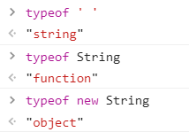

# javaScript

脚本语言

解释性、嵌套在HTML中、弱数据类型、跨平台、基于对象、基于事件驱动

## 基础

### 样式

 内部

 ```html
 <script>
     alter("helloworld")
 </script>
 ```

外部引入

a.js

```javascript
alter("helloworld")
```

test.html

```html
<script src="a.js"></script>
```

行内

```html
<a href="javascript:alert('你好');"></a>
```


###数据类型

==变量==
var
let

==Number==
js不区分小数和整数，Number

```javascript
123//整数
123.1//浮点数
1.123e3//科学计数法
-99//负数
NaN//not a number
Infinity//表示无限大
isNaN(n)
```


==字符串String==
‘abc’ ,"abc","\n"

==布尔值Boolean==

true,false

除0以外都为true

除“ ”之外的字符，都为true

null和undefined返回false

==逻辑运算==
&&，||，！

==算术运算符==

a++先取a的值，然后执行+1

++a先执行+1,再取a的值

- document.write()向页面写入信息

==比较运算符==

```
==//赋值
==//等于（数值一样，类型可以不一样 返回true）支持自动转换
===//绝对等于（数值、类型都一样返回true）
```

须知：

- NaN与所有数值包括自己都不相等

==null和undefined==

- null表示空
- undefined==null返回true

==数组Array==

不需要类型相同,数组越界undefined

```javascript
var arr=[1,2,3,'hello']
```

==Function==


==对象Object==

数组中括号，对象大括号,属性逗号隔开

```javascript
var person={
  name:'xx',
  age:18
}
```

- 严格模式“use strict”预防javascript随意性而产生的问题，script标签首行

- typeof 获取数据类型

  

##流程控制

if判断

while循环

for循环

forEach循环

````javascript
var age=[1,2,3,4,5];
age.forEach(function(value){
    console.log(value);
})
````

for in循环

```html
<script type="text/javascript">
	for(i in 'adasdasd'){
        console.log(i);;
    }
    var x='sdsdsa';
    for(i in x){
        console.log(x.charAt(i));
    }
</script>
```


for(var index in Object){}

## 函数

###预定义函数

javascript引擎中预先定义的

- parseInt()字符串转整型

- parseFloat()字符串转浮点型

- isNaN() 

  是返回false，不是返回true

-  isFinite() 是否无穷,是false，不是true
- escape()字符串转Unicode码
- unescape()解码
- 对话框alert()、prompt()、confirm()

### 自定义函数

使用函数时，先定义后调用

#### 命名函数

```html
<script type="text/javascript">
    function add(a,b){//add方法名
        a=a||0;//无数值就用0
        b=b||0;
        return a+b;
    }
    console.log(add());//打印到控制台，结果为0；若不赋值返回NaN
</script>
```

#### 匿名函数

网页前端设计者经常使用的一种函数形式，通过表达式形式来定义一个函数

- 匿名函数的定义格式与命名函数基本相同，只是不提供函数名称，且在函数结束位置以 ; 结束
- 由于没有函数名字，所以需要使用变量对匿名函数进行接收，方便后面函数体调用
- 需要调用

```html
<script type="text/javascript">
    var f=function(a,b){
        return a+b;
    }
    console.log(f);//打印函数内容
</script>
```

#### 对象函数

javascritpt还提供Function类，用于定义函数

Function是用来定义函数的关键字，首字母必须大写

```html
<script type="text/javascript">
    var f1=new Function('a','b','a+b');
    console.log(f1(2,3));//打印函数内容
</script>
```

#### 自调函数

函数本身不会自动执行，只有被调用时才会执行

自调函数，将函数的定义与调用一并实现

```html
<script type="text/javascript">
    (function(x1,x2){
        console.log(x1,x2);
    })(2,3);
</script>
```

```html
//点击box,输出box序号
<!DOCTYPE html>
<html>
	<head>
		<meta charset="utf-8" />
		<title></title>
		<style type="text/css">
			* {
				margin: 0;
				padding: 0;
			}
			
			.box {
				width: 100px;
				height: 100px;
				margin: 15px;
				background-color: red;
				cursor: pointer;
				float:left;
			}
		</style>
	</head>

	<body>
		<div class="box">0</div>
		<div class="box">1</div>
		<div class="box">2</div>
		<script type="text/javascript">
			var box=document.querySelectorAll(".box");
			console.log(box);
			for(var i=0;i<box.length;i++){
				(function(i){
					box[i].onclick=function(){
						console.log(box[i],i);
					}
				})(i);
			}//使用自调函数
			/*box.forEach(function(item,index){
				item.onclick=function(){
					console.log(item,index);
			});*///不使用自调
		</script>

	</body>

</html>
```


## 对象

###1. Array数组对象

**创建方式**

new Array();

new Array(size);

new Array(element0,element1...);

**属性**

constructor:获得具体对象类型

length

prototype：原型方法

**常用方法**

| 方法      | 描述                                                         |
| :-------- | :----------------------------------------------------------- |
| concat()  | 连接两个或多个数组                                           |
| join()    | 把数组中的所有元素放入一个字符串，并用指定的分隔符隔开       |
| push()    | 向数组末尾添加一个或多个元素，并返回新的长度                 |
| pop()     | 删除并返回数组的最后一元素                                   |
| shift()   | 删除并返回数组第一元素                                       |
| reverse() | 在原有数组的基础上，颠倒数组中的元素顺序，不会创建新的数组   |
| slice()   | 从已有数组中返回选定元素（包头不包尾，参数为负数从尾部开始）slice(start,[end]) |
| sort()    | 排序（不是按大小排序）                                       |
| splice()  | 向数组中添加或删除一个或多个元素，然后返回选定元素 splice(start,delnum,[item1,...]) |

[]:表示可不写

````html
/*排序*/
<script>
    /*匿名函数*/
	var x=[1,28,34,5,7];
	x.sort(function(a,b){
    	return a-b;//从小到大排序
	});
    /*lambda表达式*/
    x.sort((x1,x2)=>x1-x2);
</script>
````

````html
/*在prototype添加sum（）*/
<script>
    var a=[1,2,3,4,5];
    Array.prototype.sum=function(){
        var sum=0;
        let o=this;//this就是数组a
        for(var i=0;i<o.length;i++){
            sum+=o[i];
        }
    }
</script>
````


**二维数组**

### 2. String 字符串对象

**字面量方式**

```javascript
var a="13"//typeof 是string
```

**new方式**

```javascript
var a=new String("13")//typeof 是一个对象
var a1=String('13')//typeof 是string
```

**tips:**

==string与String的区别==

- String是string的包装类
- string是一种数据类型；String是构造函数用于创建字符串对象，使用new方法创建对象具有substring()方法
- 
- 使用==时，string只比较值，String还需比较是否为同一对象引用
- 生命周期不同，new创建的对象一直存在,string类型自动生成会在代码执行后立即摧毁

通过constructor获得具体对象类型

```javascript
var b=new String('1')
b.constructor==Stirng//返回true
```

**常用方法**

| 方法                                 | 描述                                                         |
| ------------------------------------ | ------------------------------------------------------------ |
| indexOf(searchValue,[fromIndex])     | 返回searchValue在字符串中首次出现的位置的位置                |
| lastIndexOf(searchValue,[fromIndex]) | 从后向前检索，返回searchValue在字符中首次出现的位置          |
| slice(start,[end])                   | 抽取从start（包括）开始到end（不包括）位为止的所有字符，可取负数 |
| substring(start,[stop])              | 抽取start到stop-1的所有字符                                  |
| split()                              | 把一个字符串分割成字符数组                                   |

[]:表示可不写

**转义字符**

| 转义字符 | 实现方式 | 转义字符 | 实现方式 |
| -------- | -------- | -------- | -------- |
| 双引号   | \双引号  | 换行     | \n       |
| 单引号   | \单引号  | 回车     | \r       |
| Tab      | \t       | 反斜杠   | 双斜杠   |
| 退格     | \b       | 换页符   | \f       |

###3. Date日期对象

**常用方法**

| 方法          | 描述                         |
| ------------- | ---------------------------- |
| getDate()     | 返回一个月中的某一天（1~31） |
| getDay()      | 返回一周中的某一天           |
| getMouth()    | 返回月份（0~11）             |
| getFullYear() | 返回4位数年份                |
| getHours()    | 返回Date对象的小时（0~23）   |
| getMinutes()  | 返回Date对象的分钟（0~59）   |
| getSeconds()  | 返回Date对象的秒数（0~59）   |
| getTime()     | 返回1970年1月1日至今的毫秒数 |
| setXxx()      | 设置日期对象的年月日等信息   |

````html
<html>
	<head>
		<meta charset="utf-8" />
		<title></title>
	</head>
	<body>
		<div class="timer"></div>
		<script type="text/javascript">
			//获取timer的DOM对象
			var timer = document.querySelector(".timer");
			//创建当前日期对象
			function times() {
				var d = new Date();
				var y = d.getFullYear();
				var m = d.getMonth() + 1;
				var dd = d.getDate();
				var hh = d.getHours();
				var min = d.getMinutes();
				var ss = d.getSeconds();
				var s = y + "年" + m + "月" + dd + "日" + hh + "时" + min + "分" + ss + "秒";
				timer.innerHTML	=s;
			}
			times();
			//定时器
			setInterval(times,1000);
		</script>
	</body>
</html>
````

### 4. Math数学对象

**方法**

| 方法     | 描述                         | 方法              | 描述                        |
| -------- | ---------------------------- | ----------------- | --------------------------- |
| abs(x)   | 返回数字绝对值               | min(x,y)          | 求最小值                    |
| ceil(x)  | 对数字进行向上取整           | pow(x,y)          | 返回x的y次幂                |
| floor(x) | 对数字进行向下取整           | sqrt(x)           | 返回数字平方根              |
| round(x) | 对数字进行四舍五入           | random()          | 返回0~1之间的随机数         |
| exp(x)   | 返回e的指数                  | sin/cos/tan(x)    | 计算x的正弦、余弦和正切值   |
| log(x)   | 返回数字的自然对数（底数为e) | asin/acos/atan(x) | 计算x的反正弦、余弦和正切值 |
| max(x,y) | 求最大值                     |                   |                             |

### 5. RegExp对象(？)

**创建**

1.直接量方式

​	var reg=/pattern/attribute;

2.构造函数方式

​	var regExp=new RegExp(pattern,attribute);

- pattern是一个字符串或表达式，表示正则表达式的模式
- attribute是一个可选字符串（取值包括“i”，“m”，“g”;分别用于指定全局变量、区分大小写匹配和多行匹配）

元字符

| 元字符 | 描述                                          |
| :----: | --------------------------------------------- |
|   ·    | 查找单个字符，除了换行和行结束符              |
|   \w   | 匹配包括下划线的任何单词字符等价于[A-Za-z0-9] |
|   \W   | 匹配任何非单词符，等价于[ ^A-Za-z0-9]         |
|        |                                               |
|        |                                               |
|        |                                               |
|        |                                               |
|        |                                               |
|        |                                               |

### 6. 自定义对象

```html
<script type="text/javascript">
	//原始方法
    var 0=new Object();
    o.name='json';
    o.age=12;
    o.showInfo=function(){
        console.log('name=',this.name,'age=',this.age);
    }
    console.log(o.name);//获取到该对象的属性值
    o.showInfo();
    //构造函数
    function Person(){
        this.name=name;
        this.age=age;
        this.getAge=function(){
            console.log('age=',this.age);
        }
        this.getName=function(){
            console.log('name=',this.name);
        }
    }
    var person=new Person('json',12);
    person.getAge();
    person.getName();
    //原型方法
    function Student(){       
    }
    Student.prototype.name='json';
    Student.prototype.age=12;
    Student.prototype.getAge=function(){
        renturn this.age;
    }
    Student.prototype.getName=function(){
        return this.name;
    }
    var stu=new Student();
    console.log('name=',stu.getName());
    console.log('age=',stu,getAge());
    //混合方法（构造函数+原型）
    //JSON
    var good={
        price:10.1,
        sale:!0,//true
        showInfo:function(){
            console.log('price=',this.price,'sale=',this.sale);
        },
        stop:!1//结束结尾不用,
    }
    good.showInfo();
</script>
```

## BOM与DOM

### BOM模型

定义了JavaScript操作的接口,提供了与浏览器窗口交互的功能，例如获取浏览器大小、版本信息、浏览历史记录等

用于描述浏览器中对象与对象之间层次关系的模型，提供了独立于页面内容、并能够与浏览器窗口进行交互的对象结构


浏览器会为每一页自动创建window、document、location、nacigator、history对象

- window对象是BOM模型中的最高一层，通过window对象的属性和方法来实现对浏览器窗口的操作
- document是BOM的核心对象，提供访问HTML文档对象的属性、方法以及事件处理
- location对象包含当前页面的URL地址，如协议名、主机名、端口号和路径等信息
- navigator对象包含与浏览器相关的信息，如浏览器类型、版本等
- history对象包含浏览器的历史访问记录,如访问过的URL、浏览数量等信息

### DOM模型

DOM（文档对象模型）是属于BOM的一部分，用于对BOM中的核心对象document进行操作

DOM是一种与平台、语言无关的接口，允许程序和脚本动态的访问和更新HTML或XML文档的内容、结构和样式，且提供一系列的函数和对象来实现访问、添加、修改及删除操作


浏览器的全局对象是window

所有的全局变量实际上都是window的成员

window.document表示浏览器窗口中的HTML页面

doucment.write()将内容写入页面

页面中的元素就是document里的成员

### 事件

**操作事件**：用户在浏览器中操作所产生的事件（鼠标事件、键盘事件、表单事件）

**文档事件**：文档本身所产生的事件，如文件加载完毕，卸载文档和窗口改变等事件

```html
<!--HTML元素的属性绑定-->
<input type='button' onclick='doSomething()' id='muButton'/>
<script type='text/javascript'>
	function doSomething(){
        alert("Hello")
    }
</script>
<script type='text/javascript'>
	//javasript脚本动态绑定
    var myButton=document.getElementById('muButton');
    myButton.onmouseover=function(){
        alert('')
    }
</script>
```

### window对象

setTimeout()、clearTimeout()、setInterval()、clearInterval()

### document对象方法

| 方法                     | 描述                                                       |
| :----------------------- | ---------------------------------------------------------- |
| write()                  | 向文档写入HTML或javaScript代码                             |
| writeln()                | 比write（）多一个换行                                      |
| getElementById()         | 返回指定ID的对象                                           |
| getElementsByName()      | 返回指定名称对象集合                                       |
| getElementsByTagName()   | 返回带有指定标签名的对象的集合                             |
| getElementsByClassName() | 返回带有指定class属性的对象集合，该方法属于HTML5 DOM       |
| querySelector()          | 返回满足条件的单个元素；当满足条件有多个时只返回第一个元素 |
| querySelectorAll()       | 返回满足条件的元素集合                                     |


###DOM节点


DOM可以将任何HTML或XML文档描绘成一个有多节点构成的结构。

文档节点是每个文档的根节点。

```html
<html>
    <head>
    	<title>Sample Page</title>
	</head>
    <body>
        <p>
            Hello World!
        </p>
    </body>
</html>
```

在该例子中，文档节点只有一个子节点<html>元素，称之为文档元素。

文档元素是文档的最外层元素，文档中的其他元素都包含在文档元素中；每个文档只能有一个文档元素。

##### Node类型

JavaScript中的所有节点类型都继承自Node类型——>所有节点类型都共享着相同的基本属性和方法。

每个节点都有一个nodeTypt属性，用于表示节点类型（12个数值常量表示）。

<!--节点类型：-->

<!--NODE.ELEMENT_NODE(1)-->

<!--NODE.ATTRIBUTE_NODE(2)-->

<!--NODE.TEXT.NODE(3)-->

<!--NODE.CDATA_SECTION_NODE(4)-->

<!--NODE.ENTITY_REFERENCE_NODE(5)-->

<!--NODE.ENTITY_NODE(6)-->

<!--Node.PROCESSING_INSTRUCTION_NODE(7)-->		

<!--Node.COMMENT_NODE(8)-->

<!--Node.DOCUMENT_NODE(9)-->

<!--Node.DOCUMENT_TYPE_NODE(10)-->

<!--Node.DOCUMENT_FRAGMENT_NODE(11)-->

<!--Node.NOTATION_NODE(12)--> 

1. nodeName和nodeValue属性

   这两个属性取决于节点的类型

   ```javascript
   if(someNode.nodeType==1){
   	value=someNode.nodeName;//nodeName的值是元素的标签名
   }
   ```

   

2. 节点关系

   每个节点都有一个childNodes属性，其中一个保存着一个<u>NodeList对象</u>。

   NodeList是一种类数组对象，用于保存一组有序的节点，可以通过位置来访问这些节点。

   ```javascript
   var firstChild = someNode.childNodes[0];
   var secondChild = someNode.childeNodes.item(1);
   var count = someNode.childeNodes.length;
   ```

   

3. 操作节点

4. 其他方法

